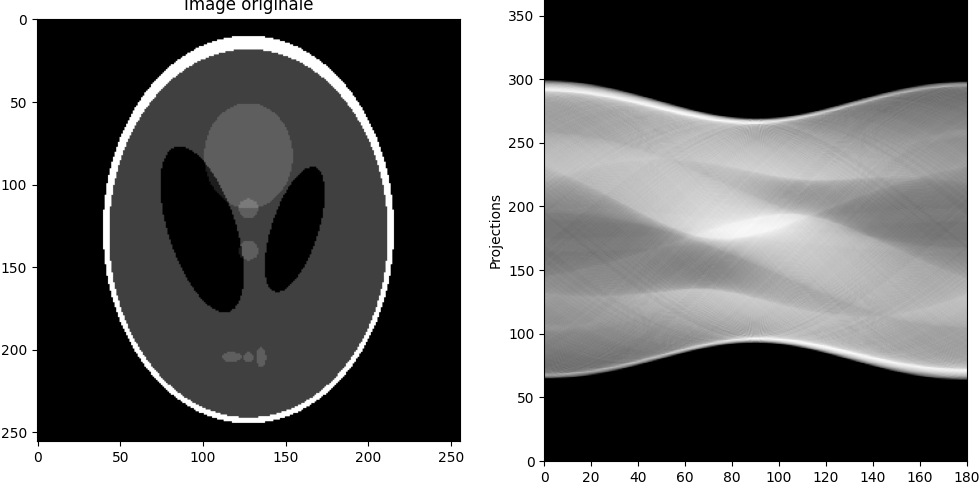
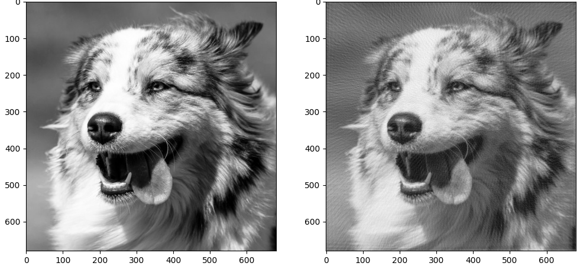

# Radon-transform-and-Inverse-Radon-transform

The file 'sinogram.py' calculates the Radon transform of a grayscale square image in .txt format.
The file 'Filtered_back_projection.py' calculates the Radon transform of a grayscale square image in .txt format, then applies filtered back projection to the Radon transform.
The file 'convert_grayscale_txt.py' allows you to convert a jpg or png image into a grayscale .txt format.
Use square image.

You can use the following files to calculate Radon and iRadon transforms:
The file 'phantom.txt' contains the attenuation coefficient values of the Shepp-Logan phantom in 256*256 pixels.

Don't forget to input the links to your images at the beginning of the 'sinogram.py' and 'Filtered_back_projection.py' scripts before running the program.

**Sinogram of the Shepp-Logan phantom**

**Reconstruction of an image of a dog after a Radon transform on the image**

